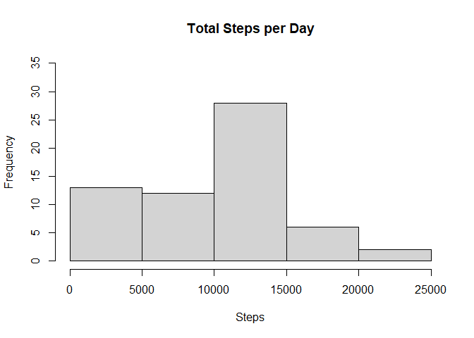
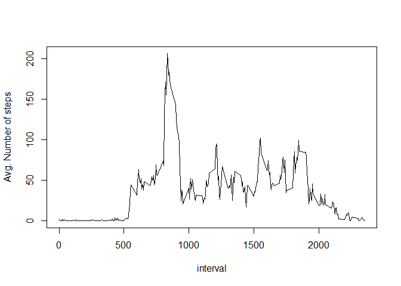
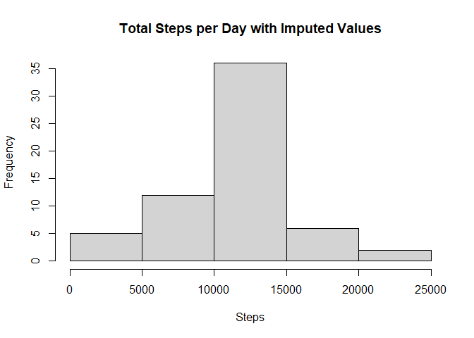
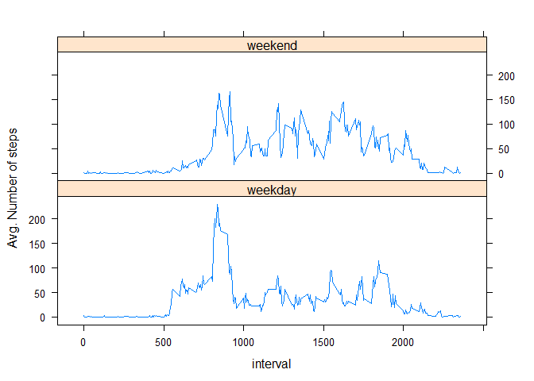

By:  Bill Kleppinger

## Loading and preprocessing the data

Get the data and do some basic checks.  

```r
if(!file.exists("./data")) { dir.create("./data") }

if(!file.exists("./data/activity.csv")) {
      unzip("./activity.zip", exdir="./data")
}

activity <- read.csv("./data/activity.csv")
str(activity)
```

```
## 'data.frame':	17568 obs. of  3 variables:
##  $ steps   : int  NA NA NA NA NA NA NA NA NA NA ...
##  $ date    : chr  "2012-10-01" "2012-10-01" "2012-10-01" "2012-10-01" ...
##  $ interval: int  0 5 10 15 20 25 30 35 40 45 ...
```

```r
summary(activity)
```

```
##      steps            date              interval     
##  Min.   :  0.00   Length:17568       Min.   :   0.0  
##  1st Qu.:  0.00   Class :character   1st Qu.: 588.8  
##  Median :  0.00   Mode  :character   Median :1177.5  
##  Mean   : 37.38                      Mean   :1177.5  
##  3rd Qu.: 12.00                      3rd Qu.:1766.2  
##  Max.   :806.00                      Max.   :2355.0  
##  NA's   :2304
```

So, the dataset has the expected number of rows and columns.  The interval is an integer variable and is coded as hmm (e.g., 05 is 00:05 & 2345 is 23:45).  

Load the libraries used in the analyses.  

```r
library(dplyr)
```

```
## 
## Attaching package: 'dplyr'
```

```
## The following objects are masked from 'package:stats':
## 
##     filter, lag
```

```
## The following objects are masked from 'package:base':
## 
##     intersect, setdiff, setequal, union
```

```r
library(lattice)
library(xtable)
```

## What is mean total number of steps taken per day?


```r
daily.totals <- activity %>% group_by(date) %>% summarize(total.steps = sum(steps,na.rm=TRUE))
```

```
## `summarise()` ungrouping output (override with `.groups` argument)
```

```r
hist(daily.totals$total.steps, main="Total Steps per Day", ylim=c(0,35), xlab="Steps")
```

<!-- -->

```r
steps.mean <- mean(daily.totals$total.steps)
steps.median <- median(daily.totals$total.steps)
```

The mean number of steps per day and the median number of steps per day are shown in the table below:  


```r
with.NAs <- c(steps.mean, steps.median)
t <- cbind(with.NAs)
rownames(t) <- c("mean", "median")
xt <- xtable(t)
print(xt, type="html")
```

<!-- html table generated in R 4.0.2 by xtable 1.8-4 package -->
<!-- Sat Aug 29 10:43:58 2020 -->
<table border=1>
<tr> <th>  </th> <th> with.NAs </th>  </tr>
  <tr> <td align="right"> mean </td> <td align="right"> 9354.23 </td> </tr>
  <tr> <td align="right"> median </td> <td align="right"> 10395.00 </td> </tr>
   </table>

## What is the average daily activity pattern?


```r
interval.avg <- activity %>% group_by(interval) %>%
    summarize(avg.steps = mean(steps,na.rm=TRUE))
```

```
## `summarise()` ungrouping output (override with `.groups` argument)
```

```r
with(interval.avg,
     plot(interval, avg.steps, type="l", ylab="Avg. Number of steps"))
```

<!-- -->

```r
interval.max <- interval.avg$interval[which.max(interval.avg$avg.steps)]
```

The interval with the maximum average number of steps is # 835.  


## Imputing missing values


```r
missing <- is.na(activity$steps)
numNAs <- sum(missing)
```

The number of missing values (NAs) is 2304 which is the same number reported above in the dataset summary.  The mean for a given 5-minute interval will be used to fill in missing values.  


```r
# use interval mean for missing values
a <- activity[!missing, ]
b <- activity[missing, ]
lookup <- function(x) {
      {interval.avg %>% filter(interval==x)}$avg.steps
}
for( i in 1:length(b$steps)) {
      b$steps[i] <- lookup(b$interval[i])
}
new.activity <- rbind(a, b)

new.daily.totals <- new.activity %>% group_by(date) %>% summarize(total.steps = sum(steps))
```

```
## `summarise()` ungrouping output (override with `.groups` argument)
```

```r
hist(new.daily.totals$total.steps, main="Total Steps per Day with Imputed Values", xlab="Steps")
```

<!-- -->

```r
new.steps.mean <- mean(new.daily.totals$total.steps)
new.steps.median <- median(new.daily.totals$total.steps)
```

The mean number of steps per day and the median number of steps per day for both the original data set (with.NAs) and with imputed values are shown in the table below:  


```r
imputed <- c(new.steps.mean, new.steps.median)
t <- cbind(imputed, with.NAs)
rownames(t) <- c("mean", "median")
xt <- xtable(t)
print(xt, type="html")
```

<!-- html table generated in R 4.0.2 by xtable 1.8-4 package -->
<!-- Sat Aug 29 10:44:01 2020 -->
<table border=1>
<tr> <th>  </th> <th> imputed </th> <th> with.NAs </th>  </tr>
  <tr> <td align="right"> mean </td> <td align="right"> 10766.19 </td> <td align="right"> 9354.23 </td> </tr>
  <tr> <td align="right"> median </td> <td align="right"> 10766.19 </td> <td align="right"> 10395.00 </td> </tr>
   </table>
  
  
The mean and median with imputed values are slightly higer than the values from the original dataset with NAs, the histogram with the imputed values shows a shift from the lower bins towards the central bin; the upper two bins look to be similar to those in the histogram without imputed values.  

## Are there differences in activity patterns between weekdays and weekends?


```r
z <- new.activity %>% mutate(wkff = weekdays(as.Date(date)))
zf <- factor(rep("weekday", times=length(z$date)), levels=c("weekday", "weekend"))
z <- cbind(z, zf)
wend <- z$wkff == "Saturday" | z$wkff == "Sunday"
z[wend, ]$zf <- "weekend"

z.interval.avg <- z %>% group_by(zf, interval) %>% summarize(avg.steps = mean(steps))
```

```
## `summarise()` regrouping output by 'zf' (override with `.groups` argument)
```

```r
with(z.interval.avg, 
     xyplot(avg.steps ~ interval | zf, type="l", layout=c(1,2), ylab="Avg. Number of steps"))
```

<!-- -->


The weekend plot shows more steps between 10 am and 10 pm when compared to the weekday plot (which would seem to be more consistent with, for example, an office desk work week).  

